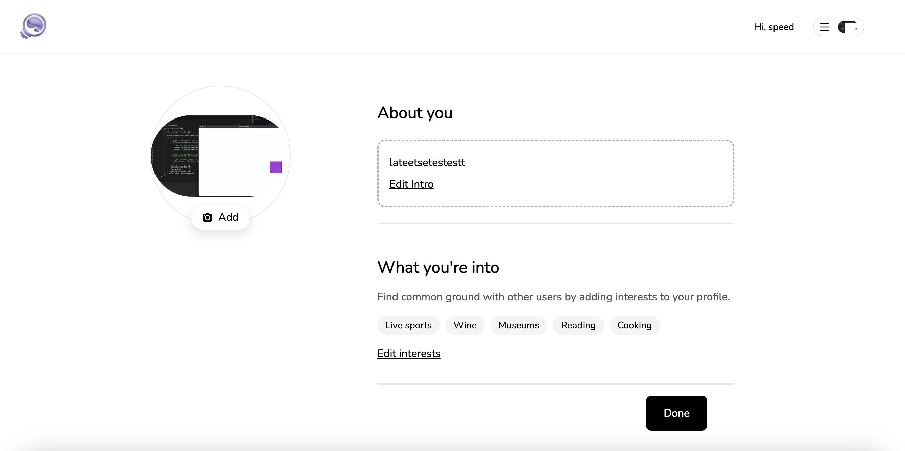

## Cloning the repository

```shell
git clone <REPOSITORY_URL>
```

## Install packages

```shell
npm i
```

## Setup Local Environment

create .env file containing :

```
DATABASE_URL=<MONGODB URL>
NEXTAUTH_SECRET=<>
```

seed the database :

```
npx prisma db seed
```

## Run the app

```shell
npm run dev
```

## Features

The app is a movie browsing platform that includes the following features:

- **Movie Browsing**: Users can effortlessly browse through a collection of movies.
- **Ticket Booking**: Users can easily select showtimes, choose seats, and secure their reservations in seconds.
- **User Balance**: The app includes a user balance feature, allowing users to make transactions using their balance instead of cash.
- **Authentication and Authorization**: The app implements authentication and authorization to ensure secure access and protect user data.
- **Registration**: Users can register an account to personalize their experience and access additional features.
- **Login**: Registered users can log in to their accounts to access their profile and saved preferences.
- **Logout**: Users can securely log out of their accounts to protect their privacy.
  Additionally, the app provides transaction history functionality, allowing users to view their past transactions and track their ticket bookings and balance usage.

- **Text-to-Speech (TTS) Playback** : The app features a text-to-speech playback button that allows users to hear movie descriptions read aloud.

## Tech 🛠

- Next.js
- Typescript
- Prisma
- SWR
- Zustand
- Tailwind CSS
- MongoDB
- Cloudinary
- Next Auth

## Screenshots

| Home Screen | Movie Detail Screen |
| --- | --- |
|  |  |
| Choose Seat Screen | Payment Screen |
|  |  |
| Balance Screen | Profile Screen |
|  |  |
| Choose Interest Screen |  |
|  |  |
